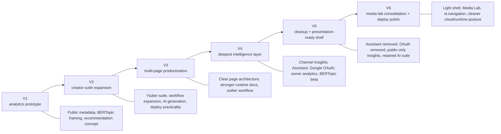
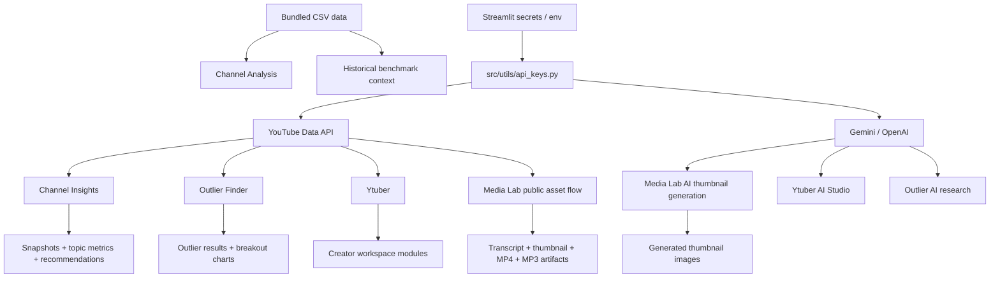
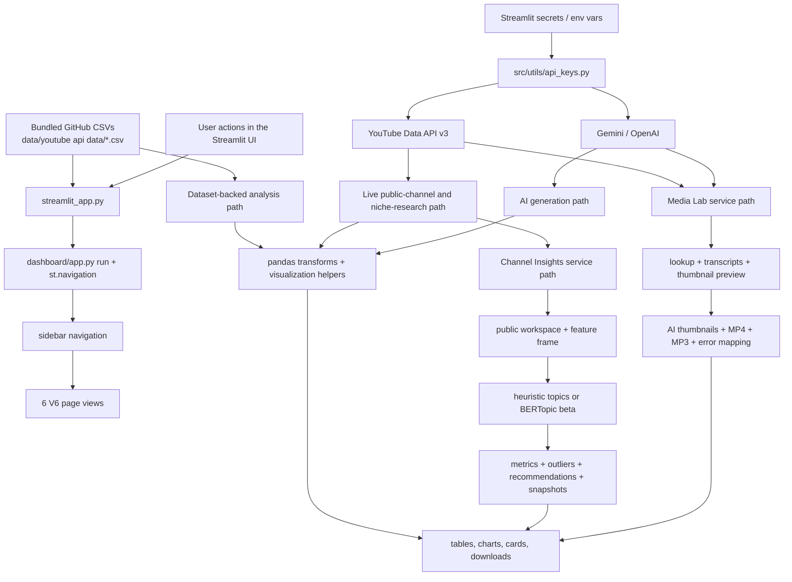
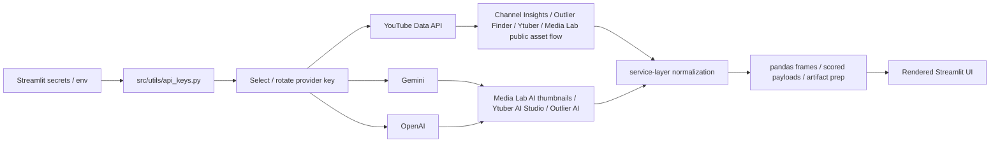
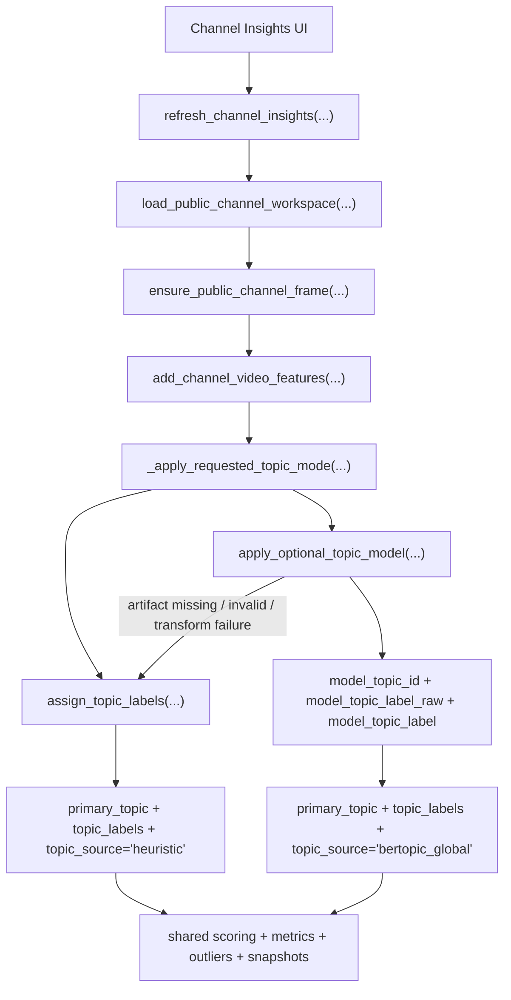
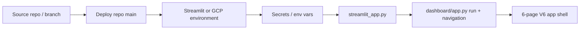

# YouTube IP V6

YouTube IP V6 is the current presentation-ready, Streamlit-deployable release. It keeps the core cross-channel analytics, public-only `Channel Insights`, bundled CSV benchmarking, and live YouTube / Gemini / OpenAI workflows from the earlier versions, while refreshing the shell around a lighter production surface:

- a light YouTube-style UI
- Streamlit-native multipage navigation with `st.navigation`
- a single `Media Lab` page instead of separate `Thumbnails` and `Tools`
- single-video transcript, thumbnail, MP4, and MP3 workflows
- clearer deployment behavior for local and Cloud runs

**Live app (V6):**

- **[youtube-ip-v6.streamlit.app](https://youtube-ip-v6.streamlit.app/)**

Earlier V5 deployment (historical): [youtube-ip-v5.streamlit.app](https://youtube-ip-v5.streamlit.app/)

Quick jump:

| If you want to understand... | Start here |
| --- | --- |
| current runtime and page flows | [Architecture](docs/ARCHITECTURE.md) |
| deployment targets, secrets, and version mapping | [Deployment And Versions](docs/DEPLOYMENT_AND_VERSIONS.md) |
| the full project story from V1 through V6 | [Project Brief](docs/PROJECT_BRIEF.md) |
| a GCP-friendly env template | [`.env.gcp.example`](.env.gcp.example) |

## At A Glance

| Metric | Current Count / State |
| --- | --- |
| Deployed versions documented here | `6` (`V1`–`V6`) |
| Live Streamlit app links (including historical) | `6` |
| Current V6 sidebar destinations | `6` |
| Current primary data paths | `2` |
| Current Channel Insights topic modes | `2` |
| Current live provider families | `3` (`YouTube`, `Gemini`, `OpenAI`) |
| Optional model-artifact path | `1` (`BERTopic` beta) |

## Current V6 In One Minute

- V6 keeps the same two core data paths as V5: bundled GitHub CSVs for benchmarking and live API pulls for channel, outlier, creator-workspace, and media workflows.
- `Channel Insights` remains public-only with two topic modes: default heuristics and optional BERTopic beta.
- `Media Lab` replaces the old separate `Thumbnails` and `Tools` pages with one single-video workspace for transcript extraction, public thumbnail export, AI thumbnail generation, MP4 prep, and MP3 prep.
- V6 introduces a lighter YouTube-style product shell: white surfaces, red accents, cleaner cards, gentler visual hierarchy, and a more focused asset workflow.
- V5 already removed the V4 `Assistant` and Google OAuth owner overlays; V6 does not bring them back.

## Why This Project Exists

The original goal of the project was simple: help small-to-mid-sized YouTube creators make better content decisions with better intelligence than YouTube Studio alone provides. The early versions focused on public metadata, cross-channel benchmarking, semantic topic modeling, and AI-assisted recommendations so the team could answer questions like:

- What content themes actually perform across comparable channels?
- Which topics, formats, and publishing patterns correlate with stronger performance?
- How can a creator move from raw channel data to a usable action plan for titles, thumbnails, and next videos?

That core question stayed constant across every version. What changed was the way the app packaged the answer.

## Version Lineage (V1–V6)

Short history before the deeper tables below.



## Deployed Version History

| Version | Live App | Main Goal | Headline Additions | Major Simplifications / Later Changes | Status |
| --- | --- | --- | --- | --- | --- |
| `V1` | [youtube-stats-ip.streamlit.app](https://youtube-stats-ip.streamlit.app/) | prove the analytics + recommendation concept | public YouTube analytics framing, BERTopic modeling direction, initial Streamlit dashboard, thumbnail dashboard | later versions expanded beyond the original compact dashboard | historical prototype |
| `V2` | [youtube-stats-ip-v2.streamlit.app](https://youtube-stats-ip-v2.streamlit.app/) | expand into a creator operating system | creator workflow framing, richer app shell, advanced Ytuber suite, deploy guidance | some modules were later split, simplified, or removed for maintainability | historical expansion |
| `V3` | [youtube-ip-v3.streamlit.app](https://youtube-ip-v3.streamlit.app/) | turn the project into a clearer product | five-page product shell, strong runtime architecture, outlier workflow, better repo map | later versions added deeper insights and then simplified again | historical productization |
| `V4` | [youtube-ip-v4.streamlit.app](https://youtube-ip-v4.streamlit.app/) | deepen intelligence and tracked-channel analysis | Channel Insights, sidebar Assistant, Google OAuth owner analytics, optional BERTopic beta | V5 removed the Assistant and Google OAuth to reduce deployment complexity | historical deep-intelligence release |
| `V5` | [youtube-ip-v5.streamlit.app](https://youtube-ip-v5.streamlit.app/) | keep the best parts and document the journey | public-only Channel Insights, retained AI suite pages, `Thumbnails`, consolidated docs, optional BERTopic beta | lighter than V4, easier to reason about, presentation-ready documentation | historical release |
| `V6` | [youtube-ip-v6.streamlit.app](https://youtube-ip-v6.streamlit.app/) | ship a dependable and cleaner creator workflow surface | light UI, `Media Lab`, `st.navigation`, explicit `run()` entry, cloud-friendly dependency cleanup | consolidates media workflows and removes active batch/playlist complexity from the live surface | **current release** |

## What Changed Across Versions

| Area | V1 | V2 | V3 | V4 | V5 | V6 |
| --- | --- | --- | --- | --- | --- | --- |
| Core problem | creator strategy from public data | same | same | same | same | same |
| Bundled dataset benchmarking | present | present | strong | present | present | present |
| Creator workspace | early | expanded heavily | strong | present | present | present |
| Outlier research | emerging | present in suite | strong standalone page | strong | strong | strong |
| Thumbnail generation | present | expanded | present | present | present | present inside `Media Lab` |
| Public asset tools | light | broader | present | present | separate `Tools` page | merged into `Media Lab` |
| Channel Insights tracked snapshots | absent | absent | absent | added | retained | retained |
| Sidebar Assistant | absent | absent | absent | added | removed | removed |
| Google OAuth / owner analytics | absent | absent | absent | added | removed | removed |
| Optional BERTopic model path | conceptual | conceptual | documented stack direction | added to runtime | retained | retained |
| Presentation-quality consolidated docs | basic | practical | stronger | strong | strongest | strongest + current-runtime sync |
| Streamlit multipage router (`st.navigation`) | — | — | — | — | custom / evolving | **built-in** |

## What Survived Into V6

- Public-data-first creator intelligence stayed central from V1 onward.
- Bundled CSV benchmarking survived as `Channel Analysis`.
- Live public-channel analysis survived and matured into `Channel Insights`.
- AI-assisted creative generation survived through `Media Lab` and `Ytuber`.
- Outlier research survived and remains a distinct workflow.
- Optional BERTopic topic modeling survived, but as a guarded beta path rather than a required dependency.
- Streamlit deployment remained the delivery surface for every released version.

## What We Tried And Later Removed Or Simplified

| Capability | Highest-Version Form | Why It Was Valuable | Why It Was Reduced Or Removed Later |
| --- | --- | --- | --- |
| Sidebar `Assistant` | V4 | gave global help and retrieval-driven guidance across pages | added surface area, more maintenance, and more cognitive load than the lighter shell needed; still absent in V6 |
| Google OAuth + owner analytics overlay | V4 | enabled private metrics such as impressions, CTR, watch time, and retention | raised deploy complexity, secrets burden, and public-vs-owner workflow branching; still absent in V6 |
| Heavier mixed recommendation UI | V3 / V4 | combined strategy guidance with creative tooling | overlapped with `Channel Analysis` and `Channel Insights`; V5 narrowed page 3 and V6 consolidates it into `Media Lab` |
| Separate `Thumbnails` and `Tools` pages | V5 | kept creation and public asset export available as separate workflows | V6 merges them into one single-video workspace to reduce navigation weight and duplicated context |
| Broad batch and playlist tooling in the live shell | V5 | useful for wide export sweeps | V6 prioritizes a cleaner production surface around high-confidence single-video workflows |

## Current V6 Product Surface

The current V6 sidebar order is:

1. `Channel Analysis`
2. `Channel Insights`
3. `Media Lab`
4. `Outlier Finder`
5. `Ytuber`
6. `Deployment`

This is the high-level page map. The detailed runtime handoffs for each page live in [Architecture](docs/ARCHITECTURE.md).

| Page | What Problem It Solves | Main Inputs | Main Outputs | Runtime Type |
| --- | --- | --- | --- | --- |
| `Channel Analysis` | benchmark bundled datasets and compare portfolio-level performance | committed CSV data in `data/youtube api data/` | KPI cards, trend charts, channel/video rankings | dataset-backed |
| `Channel Insights` | analyze one tracked public channel over time | live YouTube Data API pulls, snapshot history, optional BERTopic | topic trends, format patterns, outliers, next-topic ideas | mixed |
| `Media Lab` | handle single-video creator media tasks in one place | public YouTube URL or ID, provider/model choice, transcripts, public thumbnail variants | transcript preview/download, thumbnail preview/download, AI thumbnails, MP4, MP3 | mixed |
| `Outlier Finder` | find breakout videos in a niche | live YouTube API scans and outlier scoring | scored outlier tables, breakout snapshots, AI research | mixed |
| `Ytuber` | run a creator-focused live workspace | live channel data, AI generation, creator tools | audits, planner outputs, AI Studio results | mixed |
| `Deployment` | show deployment/setup guidance inside the app | static in-app instructions | repo, branch, secrets, deployment notes | static |

## Current V6 Workflow Map

This section is about the live app today, not the historical versions.

| Page | User Goal | Main Inputs | Main Services Used | Main Outputs | Runtime Type |
| --- | --- | --- | --- | --- | --- |
| `Channel Analysis` | compare bundled channel/video benchmarks | committed CSV files, filters, date ranges | pandas transforms, visualization helpers | KPI cards, monthly trends, top channels, top videos | dataset-backed |
| `Channel Insights` | analyze a tracked public channel over time | channel URL/handle/ID, optional beta topic mode, snapshot refresh actions | `public_channel_service`, `channel_insights_service`, `channel_snapshot_store`, `topic_model_runtime`, `model_artifact_service` | topic trends, format metrics, outliers, next-topic ideas, history | mixed |
| `Media Lab` | work from one public video through transcript, thumbnail, audio, and video tasks | single video URL/ID, provider/model choice, transcript selection, download profiles | `youtube_tools.py`, `transcript_service.py`, `thumbnail_hub_service.py`, `media_error_service.py`, `ThumbnailGenerator` | prepared downloads, transcript preview, public thumbnail grid, AI thumbnail outputs | mixed |
| `Outlier Finder` | surface overperforming videos in a niche | niche query, filters, optional AI research trigger | `outliers_finder.py`, `outlier_ai.py`, provider-key helpers | outlier cards, scored result tables, breakout charts, AI insight cards | mixed |
| `Ytuber` | open a live creator workspace for one channel | channel query, live refresh toggle, segmented workspace module selection | YouTube API loaders, keyword/title scoring helpers, thumbnail generator, outlier handoff logic | audit views, keyword tables, AI Studio outputs, planner and benchmark results | mixed |
| `Deployment` | understand how to run and deploy the app | none; in-app reference content | app shell guidance in `dashboard/app.py` | deployment instructions, repo/branch/secrets notes | static |



In practice, V6 works as three layers:

- `Data`: bundled CSV benchmarking plus live provider/API calls
- `Service`: normalization, scoring, topic assignment, artifact prep, and error mapping
- `UI`: Streamlit cards, charts, tabs, downloads, and guided workflows

For the full section-by-section mechanics, see [Architecture](docs/ARCHITECTURE.md).

## Current Interactive Surfaces

These are the main interactive surfaces a user actually navigates once a page is open.

| Page | Surface Type | Count | Current Surfaces | What They Do |
| --- | --- | --- | --- | --- |
| `Channel Analysis` | main analytics canvas | `1` | dataset filters + charts/tables | benchmark bundled CSV data |
| `Channel Insights` | tabs | `6` | `Overview`, `Topic Trends`, `Formats & Patterns`, `Outliers`, `Next Topics`, `History` | turn tracked public-channel snapshots into interpretable strategy signals |
| `Media Lab` | workflow sections | `5` | `Video Lookup`, `Transcript`, `Thumbnail Studio`, `Audio Download`, `Video Download` | handle single-video public asset and AI thumbnail workflows in one place |
| `Outlier Finder` | post-search sections | `4` | `Top Outliers In This Scan`, `Breakout Snapshot`, `AI Research`, `How This Works` | score breakout videos first, then interpret them |
| `Ytuber` | segmented modules | `8` | `AI Studio`, `Overview`, `Channel Audit`, `Keyword Intel`, `Outliers Finder`, `Title & SEO Lab`, `Competitor Benchmark`, `Content Planner` | open a live creator workspace around one channel |
| `Deployment` | in-app reference view | `1` | deployment/setup guidance | explain how to run and deploy the app |

For the detailed tab-by-tab and module-by-module behavior, see:

- [Architecture: Channel Insights](docs/ARCHITECTURE.md#channel-insights)
- [Architecture: Media Lab](docs/ARCHITECTURE.md#media-lab)
- [Architecture: Outlier Finder](docs/ARCHITECTURE.md#outlier-finder)
- [Architecture: Ytuber](docs/ARCHITECTURE.md#ytuber)

## Current V6 Architecture In One View



The architecture resolves into three repeatable patterns:

- `Dataset path`: GitHub CSVs -> pandas transforms -> benchmark visuals
- `Live API path`: secrets/env -> provider clients -> normalized payloads -> interactive pages
- `Model path`: Channel Insights feature frame -> heuristic or BERTopic topics -> downstream metrics and recommendations

For the deeper page-by-page breakdown, see [Architecture](docs/ARCHITECTURE.md#page-problem-map).

## API And Secrets Flow



This is the live V6 runtime path today:

- bundled CSVs power `Channel Analysis`
- live YouTube API calls power `Channel Insights`, `Outlier Finder`, `Ytuber`, and the public asset side of `Media Lab`
- Gemini/OpenAI power AI thumbnail generation, AI Studio, and Outlier AI research
- the same secret names work in Streamlit secrets or GCP-style injected environment variables

For the deeper API/service explanation, see [Architecture](docs/ARCHITECTURE.md#api-data-pipeline-overview).

## Channel Insights: Where The Modeling Actually Lives

`Channel Insights` is where the most advanced modeling work lands in V5/V6. Every refresh starts with the same public-channel workspace, then branches into one of two topic assignment modes:

- `Heuristic Topics`
  - default mode
  - built from title, tags, and description tokenization
  - always available
- `Model-Backed Topics (Beta)`
  - optional BERTopic semantic grouping
  - activated only when beta mode is selected and the model manifest/artifact path is configured
  - falls back to heuristics if anything fails



For the full topic-mode branch, tab flow, and artifact-state details, see [Architecture: Channel Insights](docs/ARCHITECTURE.md#channel-insights).

## Deployment Summary

| Item | Value |
| --- | --- |
| Current source branch | `Debadri1999/IP-Youtube-Creator-Insight:youtube-ip-v6` |
| Current deploy repo | `royayushkr/Youtube-IP-V6` |
| Deploy branch | `main` |
| Public V6 live app | [youtube-ip-v6.streamlit.app](https://youtube-ip-v6.streamlit.app/) |
| Historical V5 deploy repo | `royayushkr/Youtube-IP-V5` on `main` |
| Main file path (Streamlit Cloud) | `streamlit_app.py` |
| Required secret families | `YOUTUBE`, `GEMINI`, `OPENAI` |
| Optional secret family | `MODEL_ARTIFACTS_*` for BERTopic beta |



Deployment notes in one screen:

- V6 stays **public-only** for `Channel Insights` (same as V5)
- the app reads `st.secrets` first, then environment variables
- BERTopic beta only activates when `MODEL_ARTIFACTS_ENABLED=true` and the manifest URL is configured
- the GCP-oriented env template is [`.env.gcp.example`](.env.gcp.example), which is meant to be copied into Cloud Run, GCE, or Secret Manager-backed environment configuration rather than committed as a real secret file

For the full deployment matrix and secrets history, see [Deployment And Versions](docs/DEPLOYMENT_AND_VERSIONS.md).

## Project Brief And Evolution Summary

The short version of the project story is:

- `V1` proved the public-data analytics and recommendation concept
- `V2` expanded into a broader creator operating system
- `V3` clarified the product shell and runtime structure
- `V4` added the deepest intelligence layer with `Channel Insights`, Assistant, Google OAuth, and BERTopic beta
- `V5` kept the strongest workflows, removed the heaviest operational complexity, and documented the system clearly for presentation and deployment
- `V6` is the **current** Streamlit release: same public-only analysis core, but now wrapped in a lighter shell with `Media Lab`, cleaner routing, and a clearer deploy story ([live app](https://youtube-ip-v6.streamlit.app/))

What V5 removed on purpose (still true in V6):

- sidebar `Assistant`
- Google OAuth and owner-only analytics overlays
- heavier mixed recommendation behavior on page 3

What V6 changes on top of that:

- merges separate `Thumbnails` and `Tools` workflows into `Media Lab`
- removes active `Batch` and `Playlist` flows from the live shell
- adds a cleaner single-video workflow with progress and friendlier media error handling
- keeps the historical product story intact while making the live product easier to deploy and explain

For the full narrative brief and retrospective, see [Project Brief](docs/PROJECT_BRIEF.md).

## Where To Read Next

- [Architecture](docs/ARCHITECTURE.md) for the full runtime pipeline, page map, `Media Lab`, and topic-model integration details
- [Deployment And Versions](docs/DEPLOYMENT_AND_VERSIONS.md) for branch targets, secrets evolution, and version/deployment comparisons
- [Project Brief](docs/PROJECT_BRIEF.md) for the narrative project story, original goals, what changed, and how V6 builds on V5

## Ethics And Operating Principles

The original V1 principles still apply in V6:

- use public data responsibly
- respect provider terms of service
- avoid exposing personal data
- prefer explainable insights over black-box claims
- make AI-generated outputs additive to analysis, not a replacement for it

## Local Run

```bash
python3 -m venv .venv
source .venv/bin/activate
pip install -r requirements.txt
streamlit run streamlit_app.py
```
