# YouTube IP V6 Architecture

This document is the current-runtime reference for V6. The version-history story lives in the README and project brief; this file focuses on how the deployed app works today, page by page and service by service.

## Deep-Dive Guide

- [Channel Analysis](#channel-analysis)
- [Channel Insights](#channel-insights)
- [Media Lab](#media-lab)
- [Outlier Finder](#outlier-finder)
- [Ytuber](#ytuber)
- [Deployment](#deployment)
- [Model-Backed Topic Artifact Flow](#model-backed-topic-artifact-flow)

## Runtime Inventory

| Item | Count | Notes |
| --- | --- | --- |
| Streamlit entrypoints | `2` | `streamlit_app.py` and `dashboard/app.py` |
| Current sidebar destinations | `6` | `Channel Analysis`, `Channel Insights`, `Media Lab`, `Outlier Finder`, `Ytuber`, `Deployment` |
| Primary runtime data paths | `2` | bundled GitHub CSVs and live API-backed requests |
| Live provider families | `3` | `YouTube`, `Gemini`, `OpenAI` |
| Channel Insights topic modes | `2` | `Heuristic Topics` and `Model-Backed Topics (Beta)` |
| Channel Insights tabs | `6` | `Overview`, `Topic Trends`, `Formats & Patterns`, `Outliers`, `Next Topics`, `History` |
| Media Lab workflow sections | `5` | `Video Lookup`, `Transcript`, `Thumbnail Studio`, `Audio Download`, `Video Download` |
| Ytuber workspace modules | `8` | `AI Studio`, `Overview`, `Channel Audit`, `Keyword Intel`, `Outliers Finder`, `Title & SEO Lab`, `Competitor Benchmark`, `Content Planner` |
| Main Outlier Finder post-search sections | `4` | `Top Outliers In This Scan`, `Breakout Snapshot`, `AI Research`, `How This Works` |

## Sidebar Navigation

1. `Channel Analysis`
2. `Channel Insights`
3. `Media Lab`
4. `Outlier Finder`
5. `Ytuber`
6. `Deployment`

V6 keeps the V5 public-only `Channel Insights` posture, but replaces the old separate `Thumbnails` and `Tools` pages with one consolidated `Media Lab` workflow.

## Full V6 Runtime And Data Pipeline

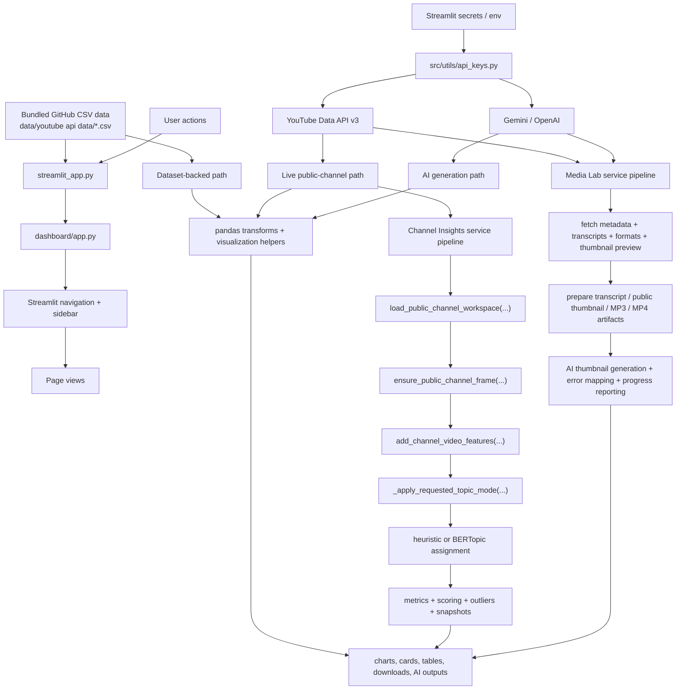

## API Data Pipeline Overview

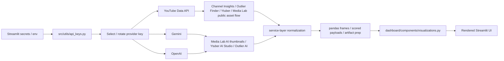

## Page Problem Map

| Page | Problem Solved | Main Services / Inputs | Main UI Outputs | Runtime Type |
| --- | --- | --- | --- | --- |
| `Channel Analysis` | benchmark committed cross-channel datasets | CSVs, pandas, visualization helpers | KPI cards, trend charts, ranked tables | dataset-backed |
| `Channel Insights` | analyze one tracked public channel over time | `public_channel_service`, `channel_snapshot_store`, `channel_insights_service`, `topic_model_runtime`, `model_artifact_service` | topic trends, format analysis, outliers, next-topic ideas, history | mixed |
| `Media Lab` | perform single-video creator media tasks without switching pages | `youtube_tools.py`, `transcript_service.py`, `thumbnail_hub_service.py`, `media_error_service.py`, `ThumbnailGenerator`, provider keys | transcript preview/download, thumbnail grid, AI-generated images, MP3/MP4 downloads | mixed |
| `Outlier Finder` | find niche winners using explainable scoring | `outliers_finder.py`, `outlier_ai.py`, YouTube API | scored outlier tables, breakout charts, AI research | mixed |
| `Ytuber` | run a live creator AI workspace for one channel | YouTube API loaders, scoring helpers, thumbnail generator, AI generation | audits, AI Studio, keyword and planner outputs | mixed |
| `Deployment` | explain setup and deployment in the app shell | static app guidance | setup and deploy notes | static |

## Channel Analysis

`Channel Analysis` is the most direct continuation of the original V1 dataset analytics idea. It stays entirely on the bundled CSV path.

### Current Data Flow

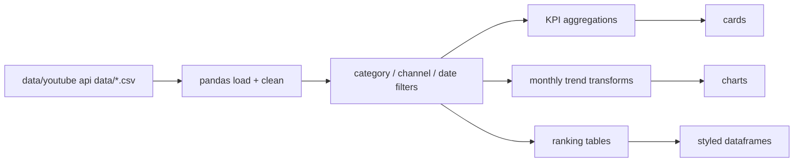

### What it outputs today

- high-level KPI summaries
- monthly upload and performance trends
- top channels and top videos
- benchmark views of publishing behavior across the bundled dataset

## Channel Insights

`Channel Insights` is the deepest current analysis path in V6. It is public-only, snapshot-based, and shares one refresh pipeline regardless of topic mode.

### Connect And Refresh Flow

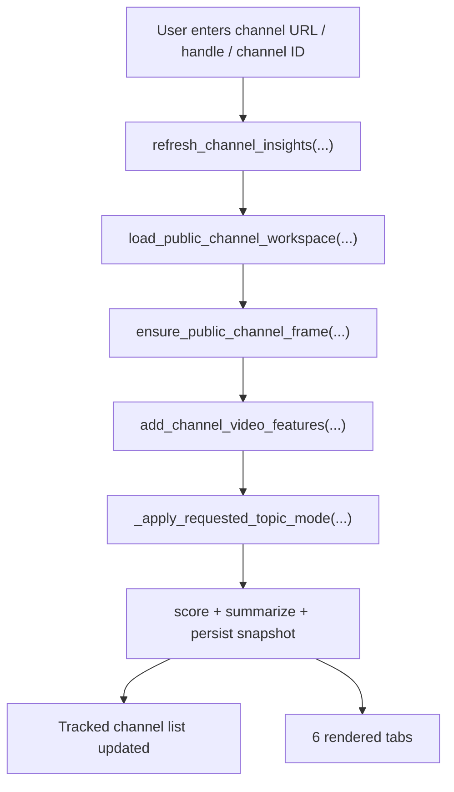

### Topic-Mode Integration

The split between topic modes happens only after the same base public-channel dataframe is built.

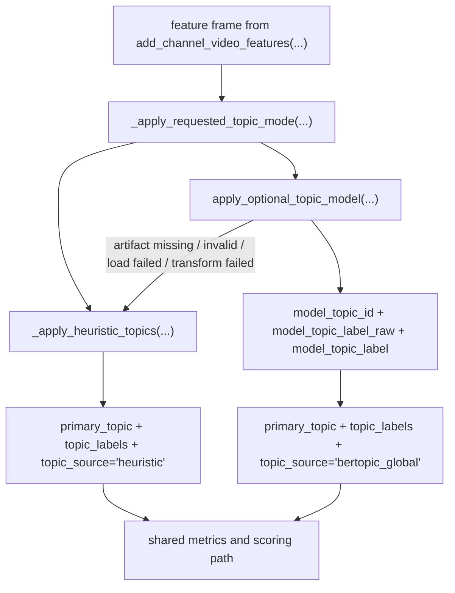

### What The Topic Fields Feed

| Field | Role In The Pipeline |
| --- | --- |
| `primary_topic` | grouping key for topic metrics and explanation text |
| `topic_labels` | per-video label list for inspection and grouping |
| `topic_source` | records whether the row came from heuristics or BERTopic beta |
| `model_topic_id` | raw BERTopic id retained when beta succeeds |
| `model_topic_label_raw` | direct label read from the model |
| `model_topic_label` | human-readable cleaned label used in the UI |

Those fields feed:

- topic metrics
- duration metrics
- title-pattern metrics
- outlier and underperformer tables
- next-topic recommendations
- persisted snapshot metadata

### Heuristic Vs Model-Backed Topics

| Mode | Better For | Constraint | Why It Exists |
| --- | --- | --- | --- |
| `Heuristic Topics` | speed, deploy safety, transparent token-based grouping | more literal topic grouping | always-available default |
| `Model-Backed Topics (Beta)` | semantic grouping across different phrasings | depends on external artifact readiness | optional richer topic clustering |

### BERTopic Artifact State Table

| Artifact State | What It Means | What The UI Shows |
| --- | --- | --- |
| `disabled` | model artifacts are not enabled in config | `Unavailable` |
| `unconfigured` | manifest URL or other required config is missing | `Unavailable` |
| `download_required` | beta is configured but artifact is not cached yet | `Download Required` |
| `ready` | artifact bundle is cached and loadable | `Ready` |
| `invalid` | manifest, checksum, or extracted bundle is not usable | `Failed / Fallback Active` |

### Heuristic Topic Derivation

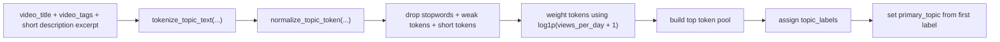

### BERTopic Beta Preprocessing

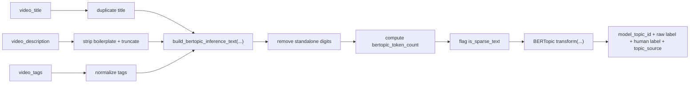

### Channel Insights Tab Flow

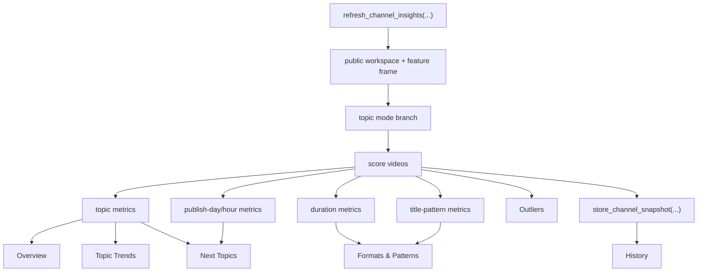

### What each Channel Insights tab does

| Tab | Current Purpose | Main Inputs |
| --- | --- | --- |
| `Overview` | summarize strongest signals, best duration/title pattern, and current channel state | summary payload, recommendation summary, topic/duration metrics |
| `Topic Trends` | show which themes are winning or fading | topic metrics dataframe and topic labels |
| `Formats & Patterns` | compare duration buckets, title patterns, and packaging effects | duration metrics and title-pattern metrics |
| `Outliers` | surface strongest and weakest recent videos with explanations | scored video frame and outlier tables |
| `Next Topics` | turn current strengths and gaps into grounded future ideas | recommendation bundle and theme cards |
| `History` | compare snapshots over time | persisted channel snapshot store |

## Media Lab

`Media Lab` is the main V6 workflow change. Historically, V5 documented separate `Thumbnails` and `Tools` pages. In current V6 those two pages are consolidated into one focused, single-video workspace.

### Current Media Lab flow

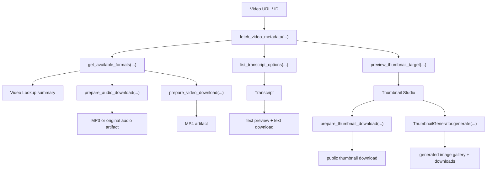

### Current Media Lab sections

| Section | Purpose | Main Services |
| --- | --- | --- |
| `Video Lookup` | validate one public video and load shared context for the rest of the page | `fetch_video_metadata(...)`, `get_available_formats(...)`, `list_transcript_options(...)`, `preview_thumbnail_target(...)` |
| `Transcript` | preview public captions and download them as text | `fetch_transcript_text(...)`, `prepare_transcript_download(...)` |
| `Thumbnail Studio` | either export public thumbnail variants or generate new AI thumbnails | `preview_thumbnail_target(...)`, `prepare_thumbnail_download(...)`, `ThumbnailGenerator.generate(...)` |
| `Audio Download` | prepare a user-friendly MP3 by default, or expose the original audio container in advanced mode | `prepare_audio_download(...)`, `ffmpeg_available()` |
| `Video Download` | prepare a downloadable MP4 using simpler quality profiles instead of broad format pickers | `prepare_video_download(...)` |

### Video Lookup

`Video Lookup` is the page anchor. It resolves the URL once and shares that result across transcript, thumbnail, audio, and video actions.

What happens on lookup:

- validate the public video target
- fetch shared metadata and available formats
- fetch transcript options
- discover public thumbnail variants
- cache the result in session state so the rest of the page does not keep reloading

### Transcript

The transcript path is deliberately stage-based and user-readable.

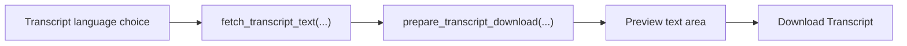

Current transcript behavior:

- shows a clean preview before download
- uses a progress/status sequence instead of a silent action
- exposes advanced transcript options inside an expander
- returns friendly errors when captions are unavailable or disabled

### Thumbnail Studio

`Thumbnail Studio` has two internal modes inside the same section:

- `Preview & Download`
- `AI Generate`

#### Public thumbnail mode

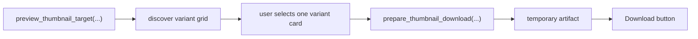

#### AI thumbnail mode

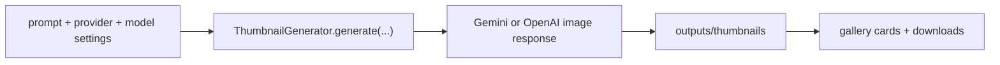

Current thumbnail behavior:

- previews multiple public resolutions in a grid
- supports provider/model selection for AI generation
- keeps advanced generation settings hidden behind expanders
- stores generated outputs under `outputs/thumbnails`

### Audio Download

Audio preparation is designed around a recommended path first and an advanced path second.

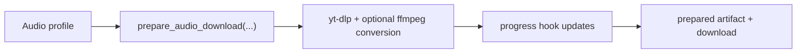

Current audio behavior:

- defaults to MP3
- keeps the original-container option as an advanced path
- shows progress through `st.progress`
- surfaces clearer messages when `ffmpeg` is missing or the video is restricted

### Video Download

Video preparation uses simpler quality profiles instead of broad format pickers.

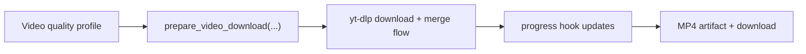

Current video behavior:

- prefers simple quality presets over raw format complexity
- returns MP4 artifacts for in-app download
- shares the same friendly error mapping as audio and transcript flows

### Media Lab error handling

`Media Lab` centralizes friendly error mapping instead of surfacing raw backend exceptions first.

| Failure Mode | Current User-Facing Behavior |
| --- | --- |
| private or deleted video | clear unavailable message |
| members-only / age-restricted / region-restricted video | friendly restriction-specific copy |
| transcript unavailable | caption-specific message and no broken preview state |
| `ffmpeg` missing | audio conversion guidance instead of a raw stack trace |
| oversized artifact | explains that the file is too large for in-app delivery |

### Historical note

In historical V5 documentation:

- `Thumbnails` was a separate page
- `Tools` had `Single`, `Batch`, and `Playlist`

In current V6 runtime:

- those workflows are merged into `Media Lab`
- only the single-video path remains active in the live surface

## Outlier Finder

`Outlier Finder` is an evidence-first, AI-second workflow. It starts from a structured search request, builds a candidate frame, scores outliers, and only then offers AI interpretation.

### Search And Scoring Flow

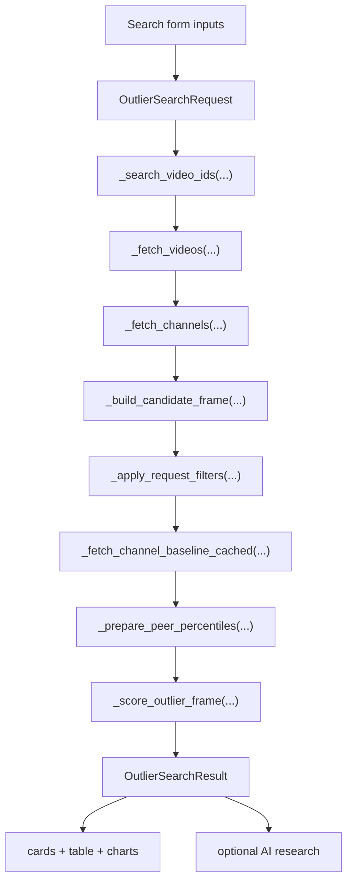

### What the search form controls

- niche query
- timeframe and custom date range
- broad vs exact match mode
- region and language
- freshness focus
- duration preference
- language strictness
- minimum views
- subscriber range and hidden-subscriber handling
- excluded keywords
- search depth and baseline limits

### Post-search result sections

| Section | What It Does |
| --- | --- |
| `Top Outliers In This Scan` | shows the scored winner set first, with result cards and the full sortable table |
| `Breakout Snapshot` | visualizes score, velocity, packaging, duration, age, and scan quality |
| `AI Research` | converts the evidence into structured research cards only after the results are visible |
| `How This Works` | explains the scoring methodology and caveats |

### Outlier Finder presentation flow

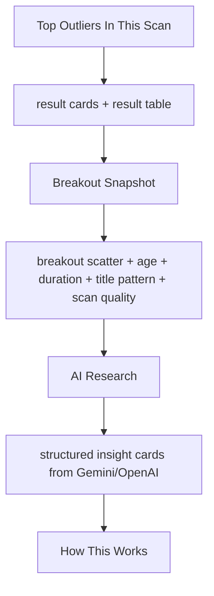

## Ytuber

`Ytuber` is a segmented live creator workspace, not a tabbed analytics page. It starts with a channel search, loads a workspace dataframe, and then lets the user switch across eight modules.

### Channel Load Flow

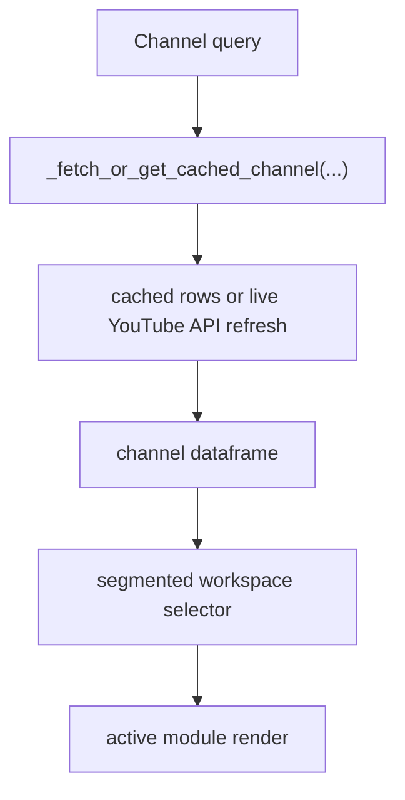

### Current Ytuber modules

| Module | Current Role |
| --- | --- |
| `AI Studio` | generate titles, descriptions, scripts, hooks, ideas, and thumbnail concepts |
| `Overview` | summarize core channel performance and recent activity |
| `Channel Audit` | show channel consistency and performance quality checks |
| `Keyword Intel` | derive recent keyword patterns and opportunity cues |
| `Outliers Finder` | hand off into a channel-contextualized outlier workflow |
| `Title & SEO Lab` | score titles and descriptions and route weak directions into AI Studio |
| `Competitor Benchmark` | compare current channel behavior to selected competitors |
| `Content Planner` | turn current patterns into scheduling and planning suggestions |

### Ytuber workspace flow

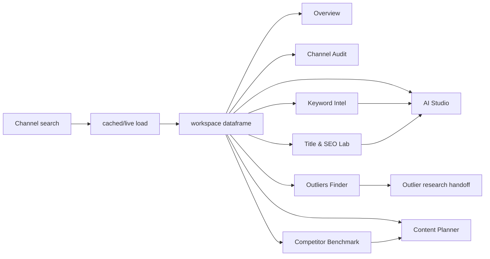

## Deployment

`Deployment` is the operational reference page inside the app shell. It does not run analysis itself; it explains how to run or deploy the app, which repo/branch is active, and which secrets need to exist.

### How it fits the shell

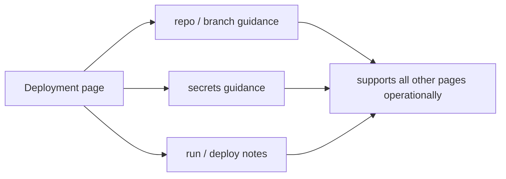

## Model-Backed Topic Artifact Flow

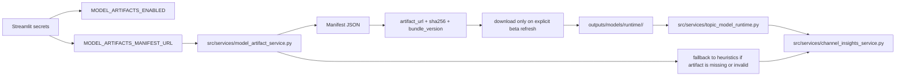

## Cross-Version Architectural Summary

```mermaid
flowchart LR
    A["V1<br/>analytics concept"] --> B["V2<br/>creator-suite breadth"]
    B --> C["V3<br/>clear page architecture"]
    C --> D["V4<br/>deep intelligence + auth branch"]
    D --> E["V5<br/>public-only clarity + deep docs"]
    E --> F["V6<br/>Media Lab + lighter live shell"]
```

| Version | Main Architectural Shift |
| --- | --- |
| `V1` | established the public-data analytics and modeling thesis |
| `V2` | expanded the product into a wide creator operating system |
| `V3` | clarified runtime shell, page ownership, and active services |
| `V4` | added Channel Insights, Assistant, Google OAuth, owner analytics, and optional BERTopic runtime |
| `V5` | removed Assistant and OAuth, kept the strongest workflows, and documented the current runtime in depth |
| `V6` | merged public asset workflows into `Media Lab`, lightened the shell, and aligned the current runtime with a cleaner deploy surface |
