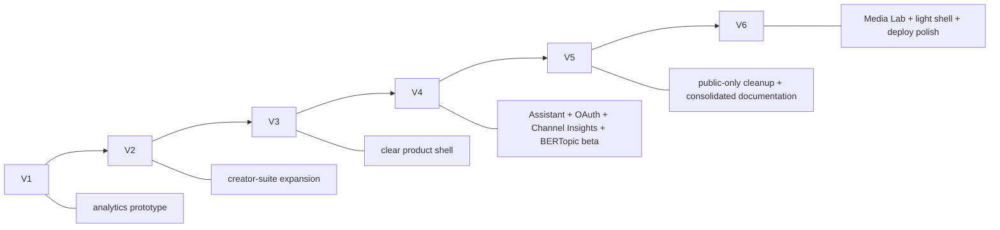
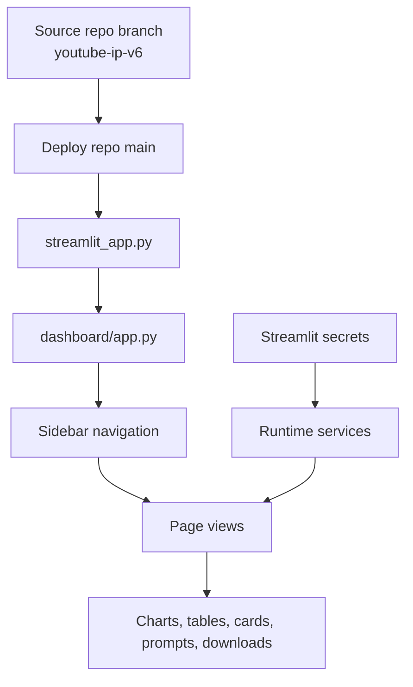
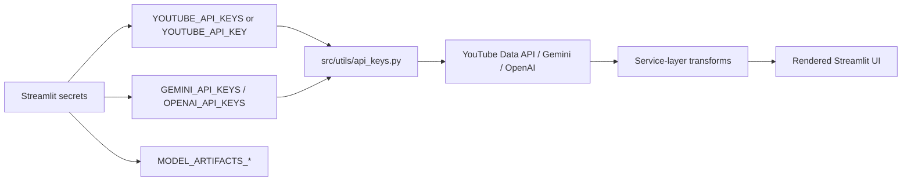
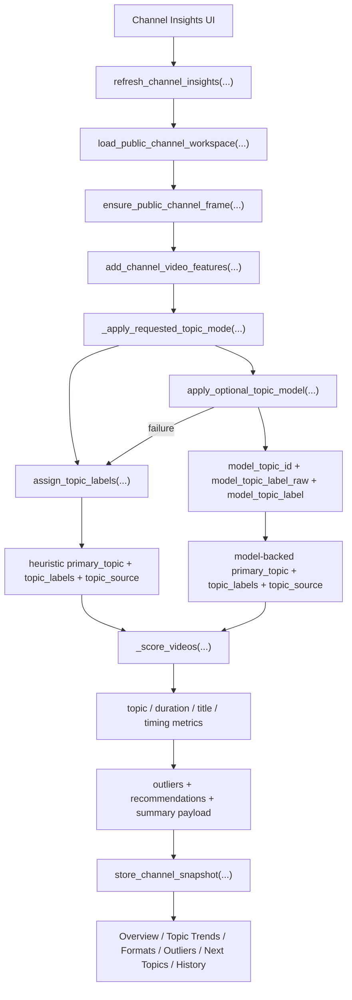
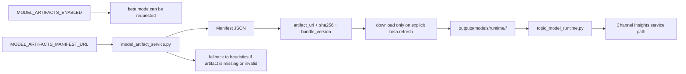

# V6 Deployment, Versions, And Model Flow

This document tracks the deployment story across all six released versions and explains how the current V6 runtime, secrets, deploy targets, and optional BERTopic path are wired today.

For the current section-by-section runtime behavior, see [Architecture](ARCHITECTURE.md). This file stays focused on deployment, version comparisons, repo targets, and the model-artifact path.

## Current V6 Branch And Repo Targets

| Item | Value |
| --- | --- |
| Current source branch | [Debadri1999/IP-Youtube-Creator-Insight/tree/youtube-ip-v6](https://github.com/Debadri1999/IP-Youtube-Creator-Insight/tree/youtube-ip-v6) |
| Deploy repo | `royayushkr/Youtube-IP-V6` |
| Deploy branch | `main` |
| Live V6 app | [youtube-ip-v6.streamlit.app](https://youtube-ip-v6.streamlit.app/) |
| Historical V5 deploy repo | `royayushkr/Youtube-IP-V5` |

## All Deployed Versions

| Version | Live Link | Product Stage | Current Reading Of That Version |
| --- | --- | --- | --- |
| `V1` | [youtube-stats-ip.streamlit.app](https://youtube-stats-ip.streamlit.app/) | prototype | proof that public YouTube metadata and modeling could power creator strategy |
| `V2` | [youtube-stats-ip-v2.streamlit.app](https://youtube-stats-ip-v2.streamlit.app/) | expansion | larger creator operating system with more AI and workflow surface |
| `V3` | [youtube-ip-v3.streamlit.app](https://youtube-ip-v3.streamlit.app/) | productization | clearer multi-page app with a stronger runtime story |
| `V4` | [youtube-ip-v4.streamlit.app](https://youtube-ip-v4.streamlit.app/) | deep intelligence | most ambitious version with Assistant, Google OAuth, and BERTopic beta |
| `V5` | [youtube-ip-v5.streamlit.app](https://youtube-ip-v5.streamlit.app/) | simplification + presentation | public-only streamlined shell with retained AI suite pages and a separate `Thumbnails` page |
| `V6` | [youtube-ip-v6.streamlit.app](https://youtube-ip-v6.streamlit.app/) | consolidation + production polish | light shell, `Media Lab`, single-video workflows, Streamlit-native routing, cleaner deployment posture |

## Version Evolution Flow



## Version Comparison Matrix

| Area | V1 | V2 | V3 | V4 | V5 | V6 |
| --- | --- | --- | --- | --- | --- | --- |
| Public dataset benchmarking | present | present | present | present | present | present |
| Live public-channel workspace | limited | expanded | present | present | present | present |
| Outlier research | early | present | strong standalone page | strong | strong | strong |
| Thumbnail generation | present | expanded | present | present | present | present inside `Media Lab` |
| Dedicated `Channel Insights` page | absent | absent | absent | present | present | present |
| Sidebar `Assistant` | absent | absent | absent | present | removed | removed |
| Google OAuth / owner analytics | absent | absent | absent | present | removed | removed |
| Optional BERTopic runtime in app | conceptual | conceptual | stack framing only | present | present | present |
| Current page 3 label | dataset/thumbnails mix | recommendations style | `Recommendations` | `Recommendations` | `Thumbnails` | `Media Lab` |

## Documented Navigation By Version

| Version | Clearly Documented Surface |
| --- | --- |
| `V1` | deployable dashboard with `Thumbnail Generator` and `Dataset Overview` |
| `V2` | creator-suite shell centered on `Ytuber`, `Recommendations`, and `Channel Analysis` |
| `V3` | `Channel Analysis`, `Recommendations`, `Ytuber`, `Outlier Finder`, `Deployment` |
| `V4` | `Channel Analysis`, `Channel Insights`, `Recommendations`, `Outlier Finder`, `Ytuber`, `Tools`, `Deployment`, plus sidebar `Assistant` |
| `V5` | `Channel Analysis`, `Channel Insights`, `Thumbnails`, `Outlier Finder`, `Ytuber`, `Tools`, `Deployment` |
| `V6` | `Channel Analysis`, `Channel Insights`, `Media Lab`, `Outlier Finder`, `Ytuber`, `Deployment` |

## Deployment Summary By Version

| Version | Primary Delivery Idea | Deployment Complexity | Why It Changed |
| --- | --- | --- | --- |
| `V1` | prove the dashboard concept | low | needed broader creator workflows |
| `V2` | broaden the suite | medium | feature breadth grew faster than documentation clarity |
| `V3` | make the app structure understandable | medium | prepared the ground for deeper intelligence features |
| `V4` | add tracked-channel depth and owner overlays | high | richest feature set, but also the heaviest deployment and secrets burden |
| `V5` | keep high-value workflows while reducing deploy risk | medium | removed Assistant and OAuth, kept the AI suite and BERTopic beta optional |
| `V6` | keep the public-only analysis core while simplifying creator media tooling | medium | merges `Thumbnails` and `Tools` into `Media Lab`, removes active batch/playlist UI, and improves deploy clarity |

## Secrets And Config Evolution

| Version | Core Secrets / Env | Why They Existed |
| --- | --- | --- |
| `V1` | `YOUTUBE_API_KEY`, later deployable `GEMINI_API_KEY`, optional `OPENAI_API_KEY` | public metadata plus the first dashboard and thumbnail-generation workflows |
| `V2` | `YOUTUBE_API_KEY`, `GEMINI_API_KEY`, `OPENAI_API_KEY`, optional `NEWSAPI_KEY` | live creator workflows, AI generation, trend/news signals |
| `V3` | pooled or single-key `YOUTUBE`, `GEMINI`, `OPENAI` formats | stronger key rotation and Streamlit deploy support |
| `V4` | V3 keys plus `GOOGLE_OAUTH_*` and `MODEL_ARTIFACTS_*` | owner analytics overlays and optional BERTopic beta runtime |
| `V5` | pooled or single-key `YOUTUBE`, `GEMINI`, `OPENAI`, plus `MODEL_ARTIFACTS_*` | public-only runtime with optional BERTopic beta, no OAuth path |
| `V6` | same V5 key families on a new deploy repo, plus the same optional `MODEL_ARTIFACTS_*` path | public-only analysis core, AI-assisted media workflows, and optional BERTopic beta |

## Current V6 Deployment Flow



The current V6 app surface behind that deployment is:

- `6` sidebar pages
- `2` primary runtime data paths
- `3` provider families
- `2` Channel Insights topic modes
- `1` consolidated `Media Lab` workflow instead of separate `Thumbnails` + `Tools`

Deeper page-by-page behavior lives in [Architecture](ARCHITECTURE.md).

## Live API And Secrets Flow



In V6, `Channel Insights` is still public-only. It does not use Google OAuth and does not merge owner-only YouTube Analytics metrics.

## Model-Backed Topic Deployment

The deploy-time settings only enable the beta path. The normal `Channel Insights` workflow still starts from public channel data and branches inside `_apply_requested_topic_mode(...)`.

### Channel Insights Topic Pipeline



### Heuristic Vs Beta Topic Modes

| Mode | What It Uses | When It Runs | Failure Behavior |
| --- | --- | --- | --- |
| `Heuristic Topics` | title, tag, and description token rules | default and always available | no external dependency |
| `Model-Backed Topics (Beta)` | BERTopic semantic inference | only when explicitly requested and configured | falls back to heuristics |

### BERTopic Artifact Flow



## Recommended Current V6 Streamlit Secrets

```toml
YOUTUBE_API_KEYS = ["your_youtube_key_1", "your_youtube_key_2"]
GEMINI_API_KEYS = ["your_gemini_key_1", "your_gemini_key_2"]
OPENAI_API_KEYS = ["your_openai_key_1", "your_openai_key_2"]

MODEL_ARTIFACTS_ENABLED = true
MODEL_ARTIFACTS_MANIFEST_URL = "https://raw.githubusercontent.com/royayushkr/Youtube-IP-V6/main/data/model_manifests/bertopic_manifest_2026.03.27.json"
MODEL_ARTIFACTS_CACHE_DIR = "outputs/models/runtime"
MODEL_ARTIFACTS_DOWNLOAD_TIMEOUT_SECONDS = 300
MODEL_ARTIFACTS_MAX_SIZE_MB = 512
```

If you want a GCP-oriented environment template instead of Streamlit secrets, use:

- [`.env.gcp.example`](../.env.gcp.example)

That file is a placeholder template only. On GCP, inject those values as real environment variables or Secret Manager-backed service variables rather than shipping a real `.env` file in the repo.

## What V6 Keeps And What It Leaves Behind

| Category | Kept In V6 | Left In Earlier Versions |
| --- | --- | --- |
| Benchmarking | dataset analytics, charts, rankings | none; this remains a through-line |
| Creator workspace | `Ytuber`, `Media Lab`, `Deployment` | sidebar `Assistant`, separate `Thumbnails`, separate `Tools`, active batch/playlist UI |
| Channel intelligence | public tracked-channel snapshots | owner-only OAuth branch |
| Modeling | heuristic topics and optional BERTopic beta | none removed here, only guarded more tightly |
| Deployment posture | Streamlit-first with cleaner V6 source->deploy mapping | heavier V4 auth overhead and separate V5 media pages |
